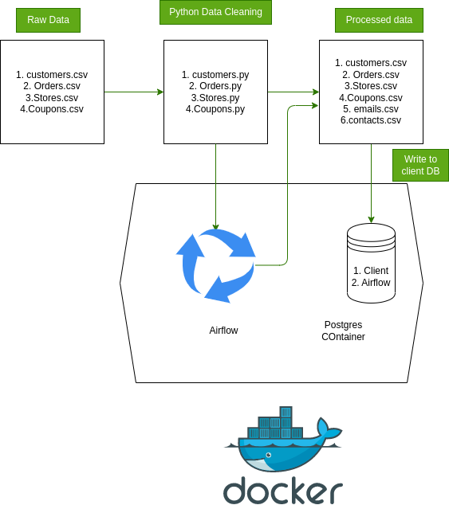
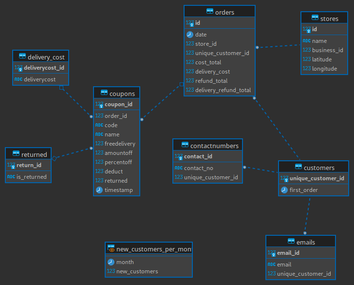
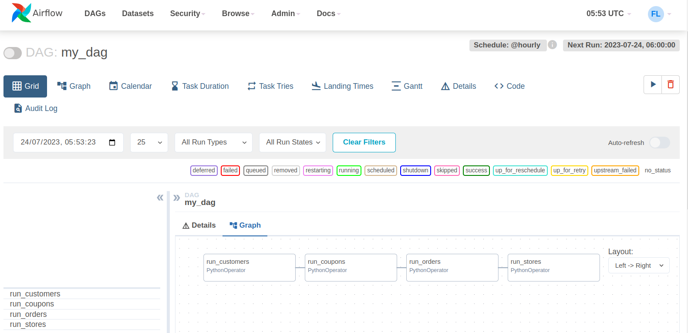

# Assessment Pack (Objective)

You have been provided four data extracts from our production database:
1) 2022 Orders
2) 2022 Coupons
3) Customer Details (pseudonymised)
4) Store Details (anonymised)

Tasks:
1) Design a logical data model 
2) Build your data model using tools of your choice (preferably, in a PostgreSQL database)
3) Create a view that shows the total number of new customers acquired in each month
4) Prepare a short presentation to summarise your work

*Hint* 
A customer is defined as new if their contact number and email address are not associated with another account. 

## Solution
I took it as an engineering project and built a solution involving Airflow, Postgress , Python and Docker. The details will be explained in the subsequent sections however the process diagram can be seen below.

P.S Airflow is an optional step of adding data in a scheduled manner to the database



## Tools used 
1. PostgreSQL:  In this solution, Postgres will have two databases initialised at the start
    - `Client` : Database to store the Client data model for our use case
    - `Airflow`: Database to be used as airflow backend for storing metadata

2. Apache Airflow: we will use Airflow to structure a dag for the data cleaning python script that can be run on schedule (hourly). <u><i>The purpose is to demonstrate the knowledge of airflow and how a Dag can be used with python operator. This is a bonus deliverable that wasn't in the base objective but it helped me refresh my knowledge of airflow and that's useful as it is used at the company currently.</i></u>

3. Docker: Docker is an engineering essential these days and great tool for setting up local test or dev environment. I have used docker compose here to containerise  
    - `Postgres databases`
    - `Airflow`

## Database Model

The database consists of 7 tables and a view:

- `Customers`: Contains the `unique_customer_id` of the customers and their first order timestamp (`first_order`).
- `Emails`: Contains a unique `email_id`, the `email` of the customer, and the `unique_customer_id` referencing the `Customers` table.
- `ContactNumbers`: Contains a unique `contact_no_id`, the `contact_no` of the customer, and the `unique_customer_id` referencing the `Customers` table.
- `Stores`: Contains information about different stores like `id`, `name`, `business_id`, `latitude`, and `longitude`.
- `Orders`: Contains order information like `order_id`, `date`, `store_id` referencing the `Stores` table, `unique_customer_id` referencing the `Customers` table, `cost_total`, `delivery_cost`, `refund_total`, and `delivery_refund_total`.
- `delivery_cost`: a table with 1 as free delivery and 0 as not free delivery
- `returned`: a table with 1 as returned and 0 as not returned
- `new_customers_per_month`: a view that shows the total number of new customers acquired in each month



## Airflow DAG

Here is the Dag that will be up and running on hourly basis. It can be used for running the cleaning data python scripts or for any other such use case. I am using this just for demonstration



## Data Processing

The data processing is done using Python scripts. Each script is tailored for a specific CSV file: `Customers.csv`, `Stores.csv`, `Orders.csv`, `Coupons.csv`. The scripts broadly perform the following operations:

- Load the raw CSV file into a DataFrame.
- Perform necessary data cleaning operations such as removing invalid entries, changing data types, and reformatting date and time values.
- In some cases, a new unique ID column is added.
- Write the processed data back into a new CSV file.

To run the scripts, you need activate the virtual environment .venv present in the root folder.

## Running the Project with Docker Compose

Docker Compose is a tool that allows you to define and manage multi-container Docker applications. In this project, it is used to create and manage the PostgreSQL database container.

To install Docker Compose, you can follow the instructions on the [official Docker documentation](https://docs.docker.com/compose/install/).

Once Docker Compose is installed, you can start the database using the following command in the root directory of the project:

```
docker-compose up
```

This command will start a 
- PostgreSQL databases in a Docker container running at port 5433. For the `Client` database the `init.sql` script will create tables and views needed for this exercise and populate them with the processed data from the CSV files.
- Airflow webserver with user name and password as `admin`. You can interact with it to see the DAG.

TO clean and shut down everything please use:

```
docker-compose down
```


Please note that Docker and Docker Compose need to be installed and running on your machine for these commands to work.

## Connect to the PostgreSQL Client Database 

Once the Docker Compose setup is running, you can connect to the PostgreSQL database using your SQL editor of choice. Here are the details you'll need:

- **Host:** localhost
- **Port:** 5433
- **User:** postgres
- **Password:** sp
- **Database:** client

In your SQL editor, look for an option to create a new connection or new server. Enter the above details in the relevant fields. Once the connection is established, you should be able to explore the database and its tables, run SQL queries, etc.
